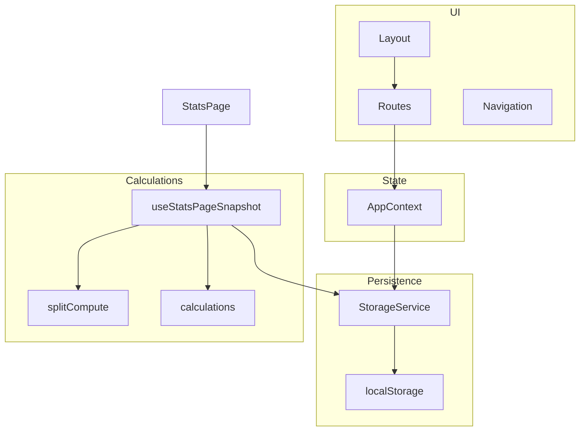

# Split Check — внутренняя спецификация

Документ описывает **текущую реализацию** (React 18, Vite 5, React Router 6): доменные структуры, персистентность, расчёты, маршруты, состояния экранов, компоненты и модальные окна.

---

## Оглавление

1. [Назначение и стек](#1-назначение-и-стек)
2. [Архитектура приложения](#2-архитектура-приложения)
3. [Модель данных](#3-модель-данных)
4. [Состояние React (`AppContext`)](#4-состояние-react-appcontext)
5. [Персистентность (`localStorage`)](#5-персистентность-localstorage)
6. [Валидация](#6-валидация)
7. [Расчёты](#7-расчёты)
8. [Маршруты и страницы](#8-маршруты-и-страницы)
9. [Компоненты (обзор)](#9-компоненты-обзор)
10. [Модальные окна](#10-модальные-окна)
11. [Сервисы](#11-сервисы)
12. [Известные особенности и мёртвый код](#12-известные-особенности-и-мёртвый-код)

---

## 1. Назначение и стек

Приложение предназначено для **разделения чека** между участниками: учёт позиций, кто платил, на кого делить (равные доли или веса), расчёт **кто кому сколько перевести** и **персональная статистика**. Данные хранятся **локально** в браузере. Поддерживается **несколько сохранённых чеков** с переключением сессии. Опционально — **распознавание чека по фото** через Google Gemini API (`VITE_GEMINI_API_KEY`).

Стек: React, `react-router-dom`, контекст без Redux, `mathjs` для точных денежных сумм в расчёте переводов, `html-to-image` для экспорта скриншотов статистики, `react-hot-toast` для уведомлений.

---

## 2. Архитектура приложения

- **`AppProvider`** оборачивает роутер и отдаёт единый контекст (`useApp`).
- **`Layout`**: основной контент + нижняя **`Navigation`** + глобальная **`StatisticsShareModal`**.
- **`App`**: `ErrorBoundary`, `Toast`, `ScrollTopButton`.

Файлы: `src/App.jsx`, `src/layout/Layout.jsx`, `src/routes.jsx`, `src/context/AppContext.jsx`.

---

## 3. Модель данных

### 3.1. Участник (`Person`)

| Поле   | Тип      | Описание                                                                                      |
| ------ | -------- | --------------------------------------------------------------------------------------------- |
| `id`   | `number` | Генерируется на клиенте при добавлении (`max(existing id) + offset` при пакетном вводе).      |
| `name` | `string` | Нормализуется: первая буква заглавная, остальные строчные (см. `PeoplePage`, `updatePerson`). |

Имя уникально **без учёта регистра** в рамках списка участников.

### 3.2. Позиция расхода (`Cost`)

| Поле               | Тип                                | Описание                                                                                                                                                                                |
| ------------------ | ---------------------------------- | --------------------------------------------------------------------------------------------------------------------------------------------------------------------------------------- |
| `id`               | `number`                           | Обычно `Date.now()` или `Date.now() + index` при массовом импорте.                                                                                                                      |
| `title`            | `string`                           | Название позиции.                                                                                                                                                                       |
| `amount`           | `number`                           | Итог по строке; при редактировании количества в карточке пересчитывается как `quantity * pricePerUnit`.                                                                                 |
| `quantity`         | `number`                           | По умолчанию `1`.                                                                                                                                                                       |
| `pricePerUnit`     | `number` \| `undefined`            | Если задано числом, **сумма строки для расчётов** берётся как `quantity * pricePerUnit` (см. `getLineAmount`).                                                                          |
| `paidBy`           | `Person[]`                         | В UI ручного режима фактически выбирается **один** плательщик за клик (`togglePaidByManual` → массив из одного элемента). В режиме «единый плательщик» подставляется выбранный человек. |
| `splitBetween`     | `Person[]`                         | Участники при **равном** разделении.                                                                                                                                                    |
| `distributionType` | `'equal'` \| `'weighted'`          | Режим деления строки.                                                                                                                                                                   |
| `weights`          | `Record<string \| number, number>` | Целые неотрицательные «единицы» доли по `person.id` (в коде везде приводятся через `Math.floor`). Ключи могут быть строковыми из JSON.                                                  |

**Весовой режим:** доля участника \(i\): \(\text{amount} \cdot w_i / \sum_j w_j\), где \(w\) — целые веса. Если при построении весов из равного сплита никто не выбран, `buildWeightsFromSplit` выставляет всем вес `1`.

**Переход equal ↔ weighted:** в `CostCard` / `AddPositionModal` при переключении на weighted вызывается `buildWeightsFromSplit(splitBetween, people)`; обратно — `splitBetweenFromWeights` и сброс `weights`.

### 3.3. Снимок сохранённого чека (`SavedCheck`)

Элемент массива `savedChecks` (и то, что загружается через `applySessionSnapshot`):

| Поле          | Тип              | Описание                                                                                                 |
| ------------- | ---------------- | -------------------------------------------------------------------------------------------------------- |
| `id`          | `string`         | UUID активной сессии (`crypto.randomUUID` или fallback).                                                 |
| `title`       | `string`         | Название чека.                                                                                           |
| `createdAt`   | `number`         | Unix ms; при первом появлении снимка в списке задаётся `Date.now()`, при обновлении сохраняется прежнее. |
| `people`      | `Person[]`       | Копия участников.                                                                                        |
| `costs`       | `Cost[]`         | Копия позиций.                                                                                           |
| `paymentMode` | `string`         | `'manual'` или `'single'`.                                                                               |
| `singlePayer` | `Person \| null` | Активный единый плательщик.                                                                              |

Текущая редактируемая сессия **непрерывно** синхронизируется в `savedChecks` по `sessionMeta.id` (`useEffect` в `AppContext`): при отсутствии записи создаётся новая в начале списка, при наличии — заменяется снимок.

### 3.4. Метаданные сессии (`sessionMeta`)

`{ id: string, title: string } | null`. Если есть люди или расходы, но `sessionMeta` отсутствует (старые данные), автоматически создаётся запись с `defaultLegacyCheckTitle()`.

### 3.5. Режим оплаты

- **`paymentMode === 'manual'`**: у каждой позиции свой `paidBy` (в UI — по сути один человек на строку).
- **`paymentMode === 'single'`**: глобальный `singlePayer`; при добавлении позиции с `CostsPage` в `paidBy` подставляется `[singlePayer]` если он выбран; `changePaymentMode('single')` перезаписывает все `paidBy` на `[singlePayer]`.

При переключении **`manual` → `single`**: текущий массив `costs` копируется в **`manualModeCosts`**, затем всем позициям выставляется плательщик из `singlePayer` (если он есть).

При переключении **`single` → `manual`**: `singlePayer` сбрасывается; если `manualModeCosts.length > 0`, `costs` восстанавливаются из этого снимка.

---

## 4. Состояние React (`AppContext`)

Экспортируется через `useApp()`.

### 4.1. Данные

- `people`, `costs`
- `paymentMode`, `singlePayer`
- `manualModeCosts` — буфер для восстановления при выходе из режима единого плательщика
- `sessionMeta`, `savedChecks`
- `isModalOpen`: `null` | `'addPerson'` | `'addCost'`
- `isPayerModalOpen`, `pendingCosts` — см. [§12](#12-известные-особенности-и-мёртвый-код)
- `newCheckModalNonce` — инкремент для открытия модалки «Новый чек» с главной FAB
- `statisticsShareModalOpen`

### 4.2. Вычисляемые флаги

- **`showCostSection`**: `people.length > 0` (используется как сигнал для секции расходов в навигации/логике при необходимости).
- **`showTransferSection`**: `true`, если есть хотя бы одна позиция с ненулевым «эффективным» разделением: есть `paidBy`, и либо weighted с суммой весов &gt; 0, либо `splitBetween.length > 0`.

### 4.3. Ключевые операции

- Участники: `addPerson` (один объект или массив; дубликаты имён отфильтровываются), `updatePerson` (проталкивает новое имя в `paidBy`/`splitBetween`/`singlePayer`/`manualModeCosts`), `removePerson` (чистит ссылки и `weights`), `removeAllPeople` (очищает также расходы и плательщика).
- Расходы: `addCost`, `addCosts`, `updateCost`, `duplicateCost`, `deleteCost`, `removeAllCosts` (очищает кеш статистики).
- Сессия: `startNewCheck`, `applySessionSnapshot`, `deleteSavedCheck`, `updateSavedCheckTitle`, `triggerNewCheckModal`.

---

## 5. Персистентность (`localStorage`)

Реализация: `src/services/storage.js`, объект **`StorageService`**.

| Ключ                                    | Назначение                                                                                    |
| --------------------------------------- | --------------------------------------------------------------------------------------------- |
| `splitcheck_people`                     | Массив участников текущей сессии.                                                             |
| `splitcheck_costs`                      | Массив позиций текущей сессии.                                                                |
| `splitcheck_payment_mode`               | `'manual'` или `'single'`.                                                                    |
| `splitcheck_single_payer`               | JSON плательщика или `null`.                                                                  |
| `splitcheck_session_meta`               | `{ id, title }` активного чека или отсутствует.                                               |
| `splitcheck_saved_checks`               | Массив сохранённых снимков чеков.                                                             |
| `splitcheck_stats_cache`                | Кеш `{ dataFingerprint, fullFingerprint, statistics, transfers }` для страницы статистики.    |
| `splitcheck_transfer_merge_ui`          | UI объединения переводов: `mergeMode`, `pendingSelection`, `committedGroups`, `transfersSig`. |
| `splitcheck_cost_card_paid_by_expanded` | `Record<costId, boolean>` — развёрнута ли секция «Кто платил?» у карточки.                    |
| `splitcheck_current_session`            | Зарезервировано в коде хранилища; использование в текущем приложении минимально/наследие.     |

Отдельно сервис ИИ пишет **`gemini_model_state`** (индекс модели и дата для ротации).

`StorageService.clearAll()` удаляет все ключи из `STORAGE_KEYS` (не обязательно `gemini_model_state`).

---

## 6. Валидация

`src/utils/validation.js`, лимиты в `src/utils/constants.js`.

### Участник (`validatePerson`)

- Имя не пустое, длина 2–50 символов.

### Позиция (`validateCost`)

- Название 2–100 символов.
- `amount` не отрицательный, не больше 1 000 000 (0 допускается — «подарок»).
- `quantity`, если задано, должно быть &gt; 0.
- `pricePerUnit` не отрицательный.
- При `distributionType === 'weighted'` сумма целых весей должна быть &gt; 0.

`addCost` с одним объектом и `updateCost` вызывают `validateCost`. Массовое добавление через `addCosts` валидацию не прогоняет (используется после сканера).

---

## 7. Расчёты

### 7.1. Сумма строки

**Файл:** `src/utils/splitCompute.js` — **`getLineAmount(cost)`**

- `qty = cost.quantity ?? 1`
- Если `pricePerUnit` задан и это число (не `NaN`): **`qty * pricePerUnit`**
- Иначе: **`Number(cost.amount) || 0`**

Все основные потребители статистики и переводов опираются на эту функцию.

### 7.2. Переводы между людьми (`getTransfersFromCosts`)

**Файл:** `src/utils/splitCompute.js`.

1. **`costsToProducts`**: каждая позиция → продукт с `amount = getLineAmount(cost)`, плательщик = `paidBy[0].name`, распределение:
   - **equal:** участники = имена из `splitBetween`;
   - **weighted:** список `{ name, units }` для людей с весом &gt; 0.

2. **`computeAll(products, peopleList)`** (через `mathjs`):
   - **Ожидаемые траты** `expected`: для каждой позиции доли поровну или по весам; суммирование по людям.
   - **Фактические траты** `actual`: вся сумма позиции относится к **`paidBy[0]`** (имя плательщика из продукта).
   - **Баланс** человека: `actual - expected` (BigNumber), сортировка по убыванию баланса.
   - **Погашение:** кредиторы (баланс &gt; 0) и должники (&lt; 0); жадное сопоставление пар, суммы округляются до 2 знаков (`math.round(..., 2)`).

3. **`getTransfersFromCosts(people, costs, paymentMode, singlePayer)`**:
   - Если нет людей или позиций → `[]`.
   - Если **`paymentMode === 'single'`** и задан `singlePayer.name` → не используется матрица парных переводов из `settleDebts`, а **`getSinglePayerTransactions`**: для каждого человека с **округлённой ожидаемой долей** `expectedRounded[i] > 0`, кроме самого плательщика, создаётся перевод `{ from: person, to: singlePayer, amount: expectedRounded }` (то есть все «должны» плательщику свою **полную ожидаемую** долю по всем позициям, а не минимальный набор переводов).

Иначе возвращается **`result.perProduct.transactions`** — результат жадного погашения после послойного учёта факт/ожидаемое по каждой позиции.

### 7.3. Статистика для UI (`calculateStatistics`)

**Файл:** `src/utils/calculations.js`.

При отсутствии людей или позиций возвращает пустые структуры.

Для каждого человека:

- **`expenses`**: по каждой позиции, где человек участвует (`personParticipatesInCost`: weighted — вес &gt; 0; equal — в `splitBetween`), строка с:
  - `description` = название позиции,
  - `amount` = доля (`getPersonShare` — аналогично весам/равным долям),
  - `quantity` / `splitCount` / `pricePerUnit` — для отображения «шт» через `formatters.formatQuantity`.
- **`totalAmount`**: сумма `getLineAmount` по позициям, где человек **в `paidBy`** (любой элемент массива с его `id`).
- **`totalOwed`**: сумма долей из `expenses`.
- **`balance`**: `totalSpent - totalOwed` (в карточке на странице статистики дополнительно пересчитывается итог по строкам `expenses` для блока «Итог»).

**`totalStats`:**

- **`totalAmount`**: сумма `getLineAmount` по всем позициям.
- **`expenses`**: агрегация по **нижнему регистру названия** позиции — одинаковые названия склеиваются, суммируются сумма и количество, пересчитывается `pricePerUnit`.

### 7.4. Неиспользуемые функции в `calculations.js`

Экорты **`initializeDebtsMatrix`**, **`updateDebtsForCost`**, **`calculateBalances`**, **`separateBalances`**, **`generateOptimalTransfers`** нигде в проекте не импортируются — это **альтернативная/устаревшая** схема матрицы долгов (равное деление только через `splitBetween.length`), не связанная с текущим пайплайном переводов на `/stats`.

### 7.5. Кеш на странице статистики

**Хук:** `src/hooks/useStatsPageSnapshot.js`.

- **`dataFingerprint`** = `hashString(JSON.stringify({ people, costs }))` (`statsFingerprint.js`).
- **`fullFingerprint`** = хэш от строки `dataFingerprint|paymentMode|singlePayer?.id`.

Логика:

1. Если нет людей или расходов → `statistics` = пустая структура, `transfers = []`, `ready = true`.
2. Иначе сначала `ready = false`, затем:
   - если кеш отсутствует или `dataFingerprint` не совпадает → полный пересчёт `calculateStatistics` + `getTransfersFromCosts`, запись в кеш;
   - иначе если не совпадает только `fullFingerprint` → статистика из кеша, переводы пересчитаны;
   - иначе всё из кеша.

При изменении людей/расходов вызывается `StorageService.clearStatsCache()` из контекста (новый чек, удаление чека, полная очистка позиций, загрузка снимка).

### 7.6. Объединение строк переводов (только UI)

**Утилиты:** `src/utils/mergeTransferDisplay.js`.

- Строки переводов с **одинаковым получателем `to`** можно в режиме merge выделить и **объединить** в одну строку с суммой сумм и подписью отправителей через запятую/перенос.
- Состояние хранится в `localStorage` и привязано к **`transferListSignature(transfers)`** — при смене списка переводов сбрасывается, если сигнатура не совпадает.
- Валидация групп: непересекающиеся индексы, одинаковый `to`, минимум 2 индекса.

Не влияет на числовую модель долгов, только на отображение в `TransferCard`.

---

## 8. Маршруты и страницы

Маршруты: `src/routes.jsx`.

| Путь              | Компонент       | Назначение                                                  |
| ----------------- | --------------- | ----------------------------------------------------------- |
| `/`               | `ChecksPage`    | Список сохранённых чеков, создание/переименование/удаление. |
| `/check/:checkId` | `OpenCheckPage` | Загрузка чека в контекст и редирект на `/`.                 |
| `/people`         | `PeoplePage`    | Участники.                                                  |
| `/costs`          | `CostsPage`     | Позиции и режим плательщиков.                               |
| `/stats`          | `StatsPage`     | Переводы и статистика.                                      |

### 8.1. `ChecksPage` (`/`)

**Состояния:**

- **Нет сохранённых чеков** — текст-подсказка про «Новый чек».
- **Список карточек** — для каждого: название, дата (`formatSavedDate`), число людей/позиций, сумма через **`sumCosts`** = сумма полей **`amount`** позиций (не `getLineAmount`; см. [§12](#12-известные-особенности-и-мёртвый-код)).
- **Активный чек** (`sessionMeta?.id === check.id`): класс подсветки карточки; клик по активному чеку блокируется с toast «Этот чек уже открыт».

**Модалки:** новый чек (название → `startNewCheck` + `navigate('/people')`); удаление чека; редактирование названия.

**FAB** (центральная кнопка на `/`): `triggerNewCheckModal` → при увеличении `newCheckModalNonce` открывается модалка создания (через `useEffect` + ref последнего nonce).

### 8.2. `OpenCheckPage` (`/check/:checkId`)

Без разметки. `useEffect`: найти чек в `StorageService.getSavedChecks()`, при отсутствии — toast и редирект на `/`; иначе `applySessionSnapshot(check)`, toast успеха, редирект на `/`.

### 8.3. `PeoplePage` (`/people`)

**Состояния:**

- **Пусто** — иллюстрация и стрелка к FAB «добавить людей».
- **Список** — карточка на человека: редактирование имени, удаление; в шапке секции «Удалить всех».

**Модалки:** `AddPersonModal` (`isModalOpen === 'addPerson'`), `EditPersonModal` (локальный `editingPerson`), подтверждение полной очистки.

Ввод в добавлении: **несколько имён через запятую** → разбор на массив объектов с инкрементными `id`.

### 8.4. `CostsPage` (`/costs`)

**Состояния:**

1. **`people.length === 0`** — пустое состояние со ссылкой на `/people`; `AddPositionModal` всё равно может открываться из навигации, но добавить осмысленно некому.
2. **`people.length > 0` и `costs.length === 0`** — пустое состояние «добавьте расходы», `ReceiptScanner`, стрелка.
3. **Есть позиции** — шапка «Расходы», переключатель режима плательщиков (Единственный / Множество), поиск по подстроке в названии позиции **или** в имени плательщика, при `single` — `PersonGrid` выбора плательщика, список `CostCard` по отфильтрованным позициям.

**Модалка** подтверждения удаления всех позиций.

**Добавление позиции:** `handleAddPosition` подмешивает `paidBy` из режима single при наличии `singlePayer`.

### 8.5. `StatsPage` (`/stats`)

**Состояния:**

1. Нет участников — как на `/costs`, ссылка на `/people`.
2. Нет расходов — ссылка на `/costs`.
3. `!ready || !statistics` — спиннер (пересчёт/кеш).
4. **`transfers.length === 0`** — спиннер + текст «Проверьте позиции» (нет валидной цепочки переводов при текущих данных).
5. **Основной вид** — блок `TransferCard`, ниже сводная карточка и персональные карточки.

**Атрибуты для шаринга:**

- Сводка: `data-stat-share="summary"`.
- Переводы: `data-stat-share="transfers"` на корне `TransferCard`.
- Участник: `data-stat-share="person"` только если `personIncludedInStatShare(person)` — потратил &gt; 0 **или** есть строки в `expenses` (`src/utils/statsShareCapture.js`).

---

## 9. Компоненты (обзор)

### 9.1. Каркас и навигация

- **`Layout`** — `main`, `Navigation`, `StatisticsShareModal`.
- **`Navigation`** — ссылки `/`, `/people`, `/costs`, `/stats`; центральная **`ActionNavButton`**: на `/` — новый чек, `/people` — открыть добавление участника, `/costs` — добавить расход, `/stats` — открыть шаринг статистики.
- **`ErrorBoundary`**, **`Toast`** (`react-hot-toast`), **`ScrollTopButton`**.

### 9.2. Карточки расхода

- **`CostCard`** — собирает `CardHeader` (редактирование через `EditPositionModal`, дублирование, удаление), при `paymentMode === 'manual'` — **`WhoPaidSection`**, **`SplitBetweenSection`** (равные / веса через `PersonGrid` / `PersonGridWeights`), **`QtyStepper`**, **`CardTotalAmount`**, локальное состояние разворота «Кто платил?» с записью в `StorageService.setCostCardPaidByExpanded`.
- **`Card`**, **`CardHeader`**, **`CardHeaderActions`**, **`CardFooter`**, **`CardTotalAmount`**, **`CardStats`** — переиспользуемые части карточек (в т.ч. список чеков).
- **`ButtonWeight`** — кнопки ± для весов (используется в весовой сетке).

### 9.3. Переводы

- **`TransferCard`** — список переводов или объединённых групп; режим merge; сохранение UI в `localStorage`; кнопки «Объединить» / «Разъединить».

### 9.4. Сканер чека

- **`ReceiptScanner`** — проверка `VITE_GEMINI_API_KEY`, модалка источника (камера / галерея), скрытые `input type=file`, загрузка → `analyzeReceipt` → **`ItemsPreviewModal`** → `onAddCosts` массивом позиций с пустым `splitBetween` в ручном режиме или с `paidBy: [singlePayer]` в single.

### 9.5. Прочее

- **`PageSectionHeader`**, **`Section`**, **`MarqueeTitle`**, **`Arrow`**, **`Spinner`**, **`IconButton`**, **`Button`**, **`ShareButton`** (если используется в проекте отдельно от модалки — зависит от импортов; в основном шаринг идёт через модалку в Layout).

---

## 10. Модальные окна

Базовый компонент: **`Modal`** (`src/components/Modal/Modal.jsx`) — нативный `<dialog>`, закрытие по клику на backdrop, блокировка `overflow` у `body`.

| Модалка                                   | Где открывается                             | Содержание / действия                                                                                                             |
| ----------------------------------------- | ------------------------------------------- | --------------------------------------------------------------------------------------------------------------------------------- |
| **Новый чек**                             | `ChecksPage`, FAB `triggerNewCheckModal`    | Поле названия, создание сессии, переход на `/people`.                                                                             |
| **Удалить чек**                           | `ChecksPage`                                | Подтверждение, `deleteSavedCheck`.                                                                                                |
| **Редактировать название чека**           | `ChecksPage`                                | Форма, `updateSavedCheckTitle`.                                                                                                   |
| **AddPersonModal**                        | `PeoplePage`, `isModalOpen === 'addPerson'` | Имена через запятую.                                                                                                              |
| **EditPersonModal**                       | `PeoplePage`, выбор человека                | Одно имя, `updatePerson`.                                                                                                         |
| **Подтверждение удалить всех участников** | `PeoplePage`                                | `removeAllPeople`.                                                                                                                |
| **AddPositionModal**                      | `CostsPage`, `isModalOpen === 'addCost'`    | Название, кол-во, цена за ед.; секции кто платил / на кого делить; переключение equal/weighted; сабмит через `onSubmit` страницы. |
| **EditPositionModal**                     | `CostCard`                                  | Редактирование названия, количества, цены за ед. (без смены плательщиков/сплита в этой модалке — они на карточке).                |
| **Удалить все позиции**                   | `CostsPage`                                 | `removeAllCosts`.                                                                                                                 |
| **StatisticsShareModal**                  | `Layout`, кнопка шаринга на `/stats`        | Список секций с `[data-stat-share]`, мультивыбор, экспорт PNG / Web Share API.                                                    |
| **Источник файла (камера / галерея)**     | `ReceiptScanner`                            | Выбор способа загрузки изображения.                                                                                               |
| **Загрузка Gemini**                       | `ReceiptScanner`, `isLoading`               | Не закрывается пользователем (`onClose` пустой).                                                                                  |
| **ItemsPreviewModal**                     | `ReceiptScanner`                            | Предпросмотр распознанных строк, подтверждение добавления.                                                                        |

---

## 11. Сервисы

### 11.1. `src/services/storage.js`

См. [§5](#5-персистентность-localstorage).

### 11.2. `src/services/ai.js`

- Вызов API Gemini для разбора изображения чека, нормализация позиций (`normalizeReceiptItems`: обрезка title, слияние дубликатов по названию и цене).
- Ротация списка моделей с дневным сбросом индекса в `localStorage` (`gemini_model_state`).

### 11.3. Утилиты отображения

- **`src/utils/formatters.js`** — суммы в RUB, склонения, формат даты сохранённого чека, дробные количества для статистики (`formatQuantity`).
- **`src/utils/tagGrid.js`**, **`src/utils/statsShareCapture.js`**, **`src/utils/shareStatisticsScreenshots.js`** — сбор DOM-узлов и PNG через `html-to-image` с фиксированной виртуальной шириной 600px и фоном `#1f1f1f`.

---

## 12. Известные особенности и мёртвый код

1. **`addCost(newCost)` при `Array.isArray(newCost)`** в `AppContext` выставляет `pendingCosts` и `isPayerModalOpen = true`, но **ни в `App.jsx`, ни в `Layout` нет рендера модалки**, выбирающей плательщика для пакета. Текущий UI всегда вызывает `addCost` с одним объектом (`CostsPage`). Ветка массива фактически **недостижима** из интерфейса.

2. **Превью суммы на `ChecksPage`** суммирует только `cost.amount`, тогда как статистика и переводы используют **`getLineAmount`** (приоритет `pricePerUnit * quantity`). Если `amount` не синхронизирован с `pricePerUnit`/`quantity`, превью может **не совпадать** с итогом на `/stats`.

3. **Функции матрицы долгов** в `calculations.js` (см. [§7.4](#74-неиспользуемые-функции-в-calculationsjs)) не используются основным приложением.

---

_Документ согласован с кодовой базой проекта split-check (Vite, `src/`). При рефакторинге расчётов или контекста этот файл следует обновлять._
